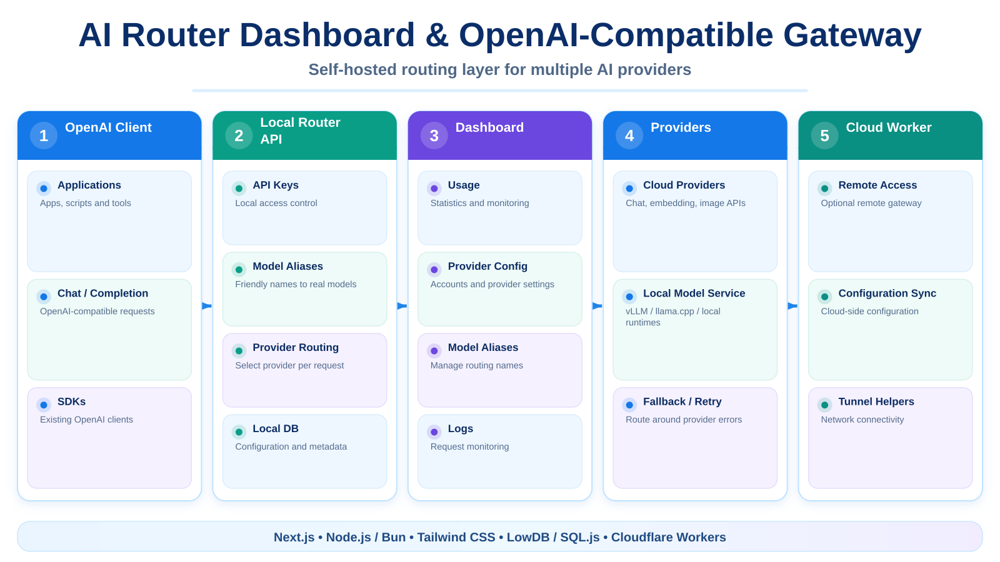

# 🔀 AI Router Dashboard & OpenAI-Compatible Gateway

> Self-hosted dashboard and local AI gateway for routing requests across multiple providers through an **OpenAI-compatible API**.

\n  \n
\n
---

## 📌 Introduction

Router_API combines a Next.js management dashboard with a local AI routing layer. It centralizes provider accounts, model aliases, API keys and local/cloud connectivity behind one endpoint that existing OpenAI-compatible clients can use.

The default local service runs on port 20128.

---

## 🚀 Key Features

- 🔀 Route requests to multiple AI providers.
- 🔌 OpenAI-compatible base API under /v1.
- 🧠 Model alias resolution and provider inference.
- 🔑 Local API key and account management.
- 📊 Web dashboard for configuration and monitoring.
- ☁️ Optional Cloudflare Worker deployment.
- 🧩 Reusable Agent Skills stored under skills/.
- 🌐 Tunnel/network helpers for local-to-remote access.
- 🛡️ MITM/tunnel management utilities used by the local runtime.
- 🧪 Vitest-based tests for embeddings and cloud routing behavior.
- 🐳 Docker support.

---

## 🏗️ Architecture

~~~text
OpenAI-compatible Client
          │
          ▼
 http://localhost:20128/v1
          │
          ▼
     Local Router
      ├── API Keys
      ├── Model Aliases
      ├── Providers
      ├── Local DB
      └── Network/Tunnel
          │
          ├────────► Provider A
          ├────────► Provider B
          └────────► Provider ...

Dashboard ─────────► Router Configuration

Optional Cloud Worker
          │
          └────────► Remote access / sync
~~~

---

## 🛠️ Technologies Used

- ⚛️ **Next.js + React**
- 🟢 **Node.js / Bun**
- 🎨 **Tailwind CSS**
- 💾 **LowDB / SQL.js**
- 🔐 **JOSE / bcryptjs**
- 📈 **Recharts**
- ☁️ **Cloudflare Workers / Wrangler**
- 🧪 **Vitest**
- 🐳 **Docker**

---

## 📂 Project Structure

~~~text
Router_API/
├── src/                  # Next.js dashboard + local router
├── open-sse/             # Shared model/provider routing helpers
├── cloud/                # Optional Cloudflare Worker
├── skills/               # Agent skill documents
├── tests/                # Unit tests
├── docs/                 # Technical notes
├── public/
├── images/
├── scripts/
├── Dockerfile
├── package.json
└── .env.example
~~~

---

## ⚙️ Installation

### 1. Clone repository

~~~bash
git clone https://github.com/tttiuem2k3/Router_API.git
cd Router_API
~~~

### 2. Create local environment

~~~bash
cp .env.example .env
~~~

### 3. Install dependencies

~~~bash
npm install
~~~

### 4. Start development server

~~~bash
npm run dev
~~~

Default URLs:

~~~text
Dashboard: http://localhost:20128/dashboard
API Base : http://localhost:20128/v1
~~~

Production:

~~~bash
npm run build
npm run start
~~~

---

## ☁️ Cloud Worker

The optional worker is located in cloud/.

~~~bash
cd cloud
npm install
npm run deploy
~~~

See [cloud/README.md](./cloud/README.md) for D1/KV and Wrangler setup.

---

## 🧩 Agent Skills

skills/ contains reusable skill documents that can be consumed by compatible AI agents.

See [skills/README.md](./skills/README.md) for the folder layout and raw URL usage.

---

## 🧪 Testing

~~~bash
cd tests
npm install
npm test
~~~

Current tests focus on embedding request validation, provider routing, retry/error behavior and cloud handlers.

---

## 📞 Contact

- 📧 Email: tttiuem2k3@gmail.com
- 👥 LinkedIn: [Thịnh Trần](https://www.linkedin.com/in/thinh-tran-04122k3/)
- 💬 Zalo / Phone: +84 329966939 | +84 336639775

---
